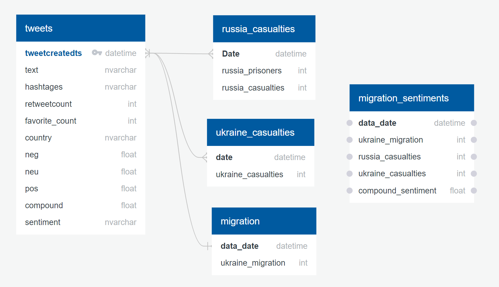
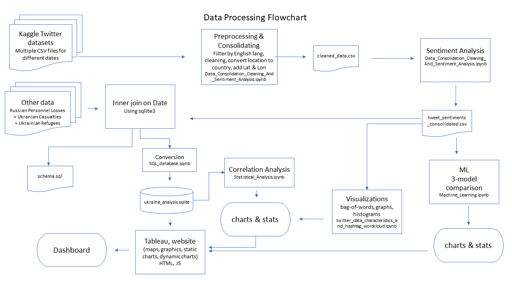

# Analyzing the Sentiment Distribution of Tweets about the War in Ukraine
The main focus of this project is Sentiment Analysis of twitter data related to the war in Ukraine and then analyzing the sentiments along with Ukraine Casualties data set and Ukraine Migration data set to derive conclusions.

## Project Structure

1. [Overview](#Overview)
- Topic rationale
- Data source
- Research questions
- Communication Protocol

2. [Data Preprocessing](#Data-Preprocessing)
- Ruchita add subsections here
- Ruchita add subsections here

3. [Sentiment Analysis](#Sentiment-Analysis)
- Ruchita add subsections here
- Ruchita add subsections here

4. [Database Storage](#Database-Storage)
- Flowchart of Data Processes and Inputs/Outputs

5. [Machine Learning](#Machine-Learning)
- Data Preprocessing for Machine Learning
- Comparison of Classification Models
- Implementation of Linear SVC

6. [Dashboard](#Dashboad)
- Tools Used
- Interactive elements
- Model Deployment

7. [Summary](#Summary)
- Project Limitations
- Recommendation for Future Analysis

### Presentation
A working presentation has been added to [Google docs](https://docs.google.com/presentation/d/1uzYRtAgBxeyVoteSkImERVQHtRtEBiBFCAVat05HdC0/edit?usp=sharing)
 

## Overview
The main goal of the present project was to identify the sentiments Twitter users have about the war in Ukraine.

### Topic Rationale
On February 24, 2022, Russia invaded Ukraine demanding an assurance that Ukraine will never join NATO. Over a dozen cities and towns were attacked, including the capital city, Kyiv (Source: [NYTimes](https://www.nytimes.com/interactive/2022/world/europe/ukraine-maps.html?searchResultPosition=3))

Since then, there have been tensions between countries, in particular with the United States and European Union supporting Ukraine, and Russia counting with Venezuela and Syria as allies (Source: [NYTimes](https://www.nytimes.com/2022/03/05/world/americas/venezuela-russia-usa.html?searchResultPosition=1)). These tensions, according to media channels and specialists, can potentially escalate the Ukrainian war to a third world war.

Besides the threat of worldwide conflict, other impacts of the Russian invasion on Ukraine has already been observed. The most prominent impact is Ukrainians’ migration to neighboring countries, such as Poland, Hungary and Slovakia. Specialists have been calling it a major refugee crisis, as of March 11 over two and a half million Ukrainians have fled their homes (Source: [The UN Refugee Agency](https://data2.unhcr.org/en/situations/ukraine#_ga=2.200929772.353981607.1646674903-2007428328.1646674903)).

### Data Source
Given the direct or indirect impact of the war in Ukraine to people’s lives, it is worthwhile to assess the sentiments people have about this event. Sentiments were identified through text data, consisting of over one million tweets downloaded from February 26 to March 10, 2022. Data was sourced from [Kaggle](https://www.kaggle.com/bwandowando/ukraine-russian-crisis-twitter-dataset-1-2-m-rows/discussion/310030). The dataset administrator used three processes to collect data:

- Process 1 hashtags: "#SlavaUkraini OR #Russia OR #RussiaUkraineWar OR #Putin OR #RussiaUkraine OR #RussianWar OR #ww3 OR #moscow OR #RussianConflict"
- Process 2 hashtags: "#ukraineunderattack OR #Ukriane OR #Ukraine OR #RussianUkrainianWar OR #UkraineRussia OR #UkraineConflict OR #UkraineWar OR #Kharkiv OR #StopPutinNow"
- Process 3: Geolocation UKRAINE country.

### Research Questions
Through the examination of tweet data, the following questions will be answered:

1. **What are the most common words mentioned on twitter about the Ukrainian war**?
2. **What is the sentiment breakdown for Ukraine war tweets**?
3. **How sentiment polarity changes over time**?
4. **Do sentiment distributions change according to country**?
5. **Is polarity related to the number of casualties in the war**?
6. **How accurate are Machine Learning models in predicting polarity based on tweet text**?

### Communication Protocol
The group has created a GitHub repository with 4 different branches for each member to work on their own branch. The 4 branches that have been created are as follows:

1. week_2_deliverables_AD : Branch for Ana Duchini
2. week_2_deliverables_AS : Branch for Aakriti Sharma
3. week_2_deliverables_FM : Branch for Flora Matos
4. week_2_deliverables_rk : Branch for Ruchika Kulkarni

Each group member has worked in a specific project task and the whole group has been communicating through slack and meeting every two days via zoom.

## Sentiment Analysis

### About Sentiment Analysis:
Sentiment Analysis, also known as Opinion Mining, is a popular data mining approach used to study the inclination of people's sentiments, opinions and emotions towards any product, global issue, event, service and organization. The sentiments are typically extracted from the text reviews, comments and surveys using tools in Natural Language Processing(NLP), Machine learning and other computational linguistics.

### Sentiment Analysis Using VADER:
For the purpose of this analysis we are using VADER (Valence Aware Dictionary sEntiment Reasoner) sentiment analysis relies on a dictionary that maps words and other lexical features common to microblogs. F1 scores have been calculated to approach 

## Data Preprocessing

### 

### Cleaning Tweets:

## Database Storage
The data (tweets data, casualty data, and migration data) has been loaded to an SQLite database using the Python sqlite3 library on [this notebook](SQL_database.ipynb). A left join for the 3 tables is performed on the date column (incorporating mean compound scores for tweets' sentiments). A copy of the output can be found in [Google Drive](https://drive.google.com/file/d/152mxp0DtOWYw0seek4LncegdKDTBk65C/view?usp=sharing). It uses the following [schema](resources/schema.sql), as laid out below:
 

### Flowchart of Data Processes and Inputs/Outputs

*Diagram of the steps followed and the files involved*

## Machine Learning
Notebook: [Machine_Learning](Machine_Learning.ipynb)
Library: SciKitLearn

### Data Preprocessing for Machine Learning
After data was cleaned and sentiment scores was computed,
data preprocessing for Machine Learning included:
 - Dropping rows with neutral sentiment scores in order to get only a binary outcome: positive or negative.
 - Getting 1% of the dataset (n = 8,083) as sample to fit our computing resources.
 - Vectorizing the text data using Term Frequency-Inverse Document Frequency (TF-IDF). The TF-IDF method consists in converting the text into numerical vectors by calculating the frequency of each text unit and assigning less weight to most frequent units. The logic is that most frequent terms are less helpful in categorizing the dataset as they appear in most cases.
 - Defining the numeric vectors as X, independent variables or features.
 - Factorizing the variable sentiment score (from positive/negative to 0/1) and defining it as y, dependent variable.
 - Setting 80% of the sample data as training set and 20% as testing set. 

### Comparison of Classification Models
As the dependent variable is categorical and binary, classification algorithms were chosen. Because they are suited to text classification tasks and easy to interpret, the following algorithms were chosen:

- Random Forest
- Multinomial Naive Bayes
- Logistic Regression
- Linear Support Vector Classification (SVC)

The models performances were compared using boxplots of the model accuracy score:

As seen in the image above, Linear SVC and Logistic Regression were the most accurate in predicting positive and negative outcomes from tweet text with 84% accuracy. Linear SVC was then chosen for implementation.

### Implementation of Linear SVC 
Our data was best classified using Linear SVC, algorithm that finds the maximal margin that separates the data into the two categories (positive or negative sentiments).

The performance of the model was satisfactory, with 84% accuracy, 84% of average precision and 83% of average recall.

## Dashboard

### Tools Used
We have used Tableau for all our data visualizations and analysis. Tableau will also be used to create a secure connection as an ODBC with Sqlite. Successful connection will help us access all our tables and databases and perform our analysis and visualizations effectively. Our final dashboard will be published on Tableau Public.

### Interactive elements
Our Dashboard in Tableau Public will have a number of interactive elements. Check boxes will be used to give the user flexibility to choose a country of choice and perform visualizations. Other checkboxes for date can be used to select date of choice and see the visualizations accordingly.

### Model Deployment
Finally the data visualizations will be deployed on Tableau Public and shared publicly.

## Summary

