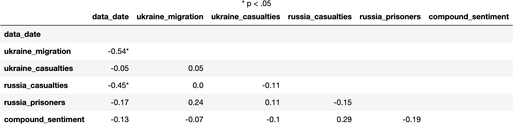
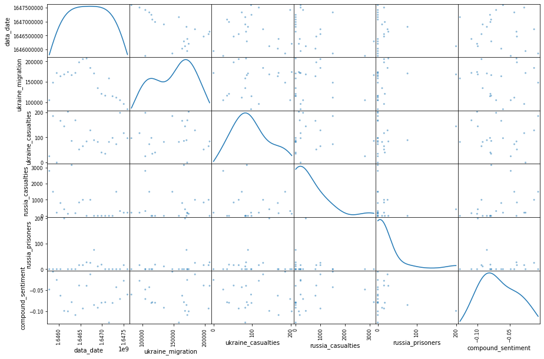

# Analyzing the Sentiment Distribution of Tweets about the War in Ukraine
The main focus of this project is the analysis of twitter users’ sentiments about the war in Ukraine. Secondary analysis of how these sentiments are related to data on war casualties and migrations from Ukraine were are also performed.

## Project Structure

1. [Overview](#Overview)
- Topic rationale
- Data source
- Research questions

2. [Data Preprocessing](#Data-Preprocessing)
- Pre-processing Pipeline
- Data Cleaning

3. [Sentiment Analysis](#Sentiment-Analysis)
- About Sentiment Analysis
- Sentiment Analysis Using VADER

4. [Database Storage](#Database-Storage)
- Flowchart of Data Processes and Inputs/Outputs

5. [Statistical Analysis](#Statistical-Analysis)
- Hypothesis
- Correlation Matrix
- Scatter Matrix

6. [Machine Learning](#Machine-Learning)
- Data Preprocessing for Machine Learning
- Comparison of Classification Models
- Implementation of Linear SVC

7. [Dashboard](#Dashboard)
- Tools Used
- Interactive elements
- Model Deployment

8. [Summary](#Summary)
- Limitations
- Future Analysis

### Presentation
A working presentation has been added to [Google docs](https://docs.google.com/presentation/d/1uzYRtAgBxeyVoteSkImERVQHtRtEBiBFCAVat05HdC0/edit?usp=sharing)
 

## Overview
The main goal of the present project was to identify the sentiments Twitter users have about the war in Ukraine.

### Topic Rationale
On February 24, 2022, Russia invaded Ukraine demanding an assurance that Ukraine will never join NATO. Over a dozen cities and towns were attacked, including the capital city, Kyiv (Source: [NYTimes](https://www.nytimes.com/interactive/2022/world/europe/ukraine-maps.html?searchResultPosition=3))

Since then, there have been tensions between countries, in particular with the United States and European Union supporting Ukraine, and Russia counting with Venezuela and Syria as allies (Source: [NYTimes](https://www.nytimes.com/2022/03/05/world/americas/venezuela-russia-usa.html?searchResultPosition=1)). These tensions, according to media channels and specialists, can potentially escalate the Ukrainian war to a third world war.

Besides the threat of worldwide conflict, other impacts of the Russian invasion on Ukraine has already been observed. The most prominent impact is Ukrainians’ migration to neighboring countries, such as Poland, Hungary and Slovakia. Specialists have been calling it a major refugee crisis, as of March 11 over two and a half million Ukrainians have fled their homes (Source: [The UN Refugee Agency](https://data2.unhcr.org/en/situations/ukraine#_ga=2.200929772.353981607.1646674903-2007428328.1646674903)).

### Data Source
Given the direct or indirect impact of the war in Ukraine to people’s lives, it is worthwhile to assess the sentiments people have about this event. Sentiments were identified through text data, consisting of over 11 million tweets downloaded from February 26 to March 19, 2022. Data was sourced from [Kaggle](https://www.kaggle.com/bwandowando/ukraine-russian-crisis-twitter-dataset-1-2-m-rows/discussion/310030). The dataset administrator used three processes to collect data:

- Process 1 hashtags: "#SlavaUkraini OR #Russia OR #RussiaUkraineWar OR #Putin OR #RussiaUkraine OR #RussianWar OR #ww3 OR #moscow OR #RussianConflict"
- Process 2 hashtags: "#ukraineunderattack OR #Ukriane OR #Ukraine OR #RussianUkrainianWar OR #UkraineRussia OR #UkraineConflict OR #UkraineWar OR #Kharkiv OR #StopPutinNow"
- Process 3: Geolocation UKRAINE country.

[The UN Refugee Agency](https://data2.unhcr.org/en/situations/ukraine#_ga=2.176425381.1265551284.1648919578-2007428328.1646674903) served as a secondary data source. From this agency, we gathered the number of refugees fleeing Ukraine from February 24 to March 19, 2022, as well as the number of war casualties for the same period.

### Research Questions
Through the examination of tweet data, the following questions will be answered:

1. **What are the most common words mentioned on twitter about the Ukrainian war**?
2. **What is the sentiment breakdown for Ukraine war tweets**?
3. **How sentiment polarity changes over time**?
4. **Do sentiment distributions change according to country**?
5. **Is polarity related to the number of casualties in the war**?
6. **Is polarity related to the number of refugees fleeing Ukraine**?
7. **How accurate are Machine Learning models in predicting polarity based on tweet text**?

## Data Preprocessing

### Pre-processing Pipeline:
Typically data pre-processing for sentiment analysis requires removal of everything other than pure text data. After this initial cleaning process, pure text, goes through a NLP pipeline consisting of tokenization, stemming, lemmatization, POS tagging and stop words removal etc.

However, due to VADER's capability of analyzing data as complete sentence the need for pre-processing the tweets is considerably minimized. The process followed for cleaning the tweets is described below.

### Cleaning Tweets:
The tweets contain a wide variety of emoticons, hashtags, mentions, special characters and hyperlinks. For the subject analysis simple textual sentences are needed to be passed to VADER. This is achieved by writing one function in python, that performs all of the aforementioned cleaning actions using regex. This function is then called on the entire dataset to render a cleaned tweets dataframe. 

## Sentiment Analysis

### About Sentiment Analysis:
Sentiment Analysis, also known as Opinion Mining, is a popular data mining approach used to study the inclination of people's sentiments, opinions and emotions towards any product, global issue, event, service and organization. The sentiments are typically extracted from the text reviews, comments and surveys using tools in Natural Language Processing(NLP), Machine learning and other computational linguistics.

### Sentiment Analysis Using VADER:
For the purpose of this analysis we are using VADER (Valence Aware Dictionary sEntiment Reasoner) sentiment analysis. It is a trained NLTK lexicon that relies on a dictionary that maps words and other lexical features common to microblogs. It is a powerful tool specifically attuned to sentiments expressed in social media.

 > Hutto, C.J. & Gilbert, E.E. (2014). VADER: A Parsimonious Rule-based Model for Sentiment Analysis of Social Media Text. Eighth International Conference   on Weblogs and Social Media (ICWSM-14). Ann Arbor, MI, June 2014.
 
Once the data is cleaned and ready for VADER, the data is analyzed by importing and using SentimentIntensityAnalyzer module from vaderSentiment package. The tweets are then passes through the analyzer and assigned polarity scores, using which we can further divide the tweets as positive, neutral and negative. Detailed demo of cleaning process and VADER sentiment analysis can be found [here](https://github.com/aduchini/Final_project/blob/main/Twitter_Vader_Sentiment_Analysis.ipynb).

## Database Storage
The data (tweets data, casualty data, and migration data) has been loaded to an SQLite database using the Python sqlite3 library on [this notebook](SQL_database.ipynb). A left join for the 3 tables is performed on the date column (incorporating mean compound scores for tweets' sentiments). A copy of the output can be found in:
> [SQLite in Google Drive](https://drive.google.com/file/d/19K75J2ouPGdZb6Kk2lWZiYaIquHsYsT4/view?usp=sharing)
 It uses the following:[schema](resources/schema.sql), as laid out below:
 

### Flowchart of Data Processes and Inputs/Outputs

*Diagram of the steps followed and the files involved*

## Statistical Analysis
Notebook: [Statistical_Analysis](Statistical_Analysis.ipynb)

### Hypothesis
A hypothesis of whether tweets sentiment polarity was related to other variables was tested. Specifically, Pearson correlation was used to test if the number of war casualties in Russia and Ukraine, the number of refugees fleeing Ukraine, the number of Russian prisoners and the day of the week was related to the compound polarity score.

H0: There is no linear relationship between variables.

H1: There is a positive or negative linear relationship between variables. 

### Correlation Matrix
As seen in the correlation matrix below, Pearson correlation values for the relationship between compound polarity and other variables were close to zero and p-values were greater than 0.05. The null hypothesis was then accepted and it was assumed that these variables are not linearly related.

There were significant negative relationships between date and number of migrants as well as number of casualties in Russia. These relationships might warrant more attention later in the analysis of how migration and casualties change across time.

### Scatter Matrix
Scatter plots were also generated to check if there was a clear non-linear relationship between compound polarity and other variables. From visual inspection of the scatter matrix below, points look spread out and there is no clear distribution pattern.

## Machine Learning
Notebook: [Machine_Learning](Machine_Learning.ipynb)

Library: SciKitLearn

### Data Preprocessing for Machine Learning
After data was cleaned and sentiment scores was computed,
data preprocessing for Machine Learning included:
 - Dropping rows with neutral sentiment scores in order to get only a binary outcome: positive or negative.
 - Getting 1% of the dataset (n = 10,855) as sample to fit our computing resources.
 - Vectorizing the text data using Term Frequency-Inverse Document Frequency (TF-IDF). The TF-IDF method consists in converting the text into numerical vectors by calculating the frequency of each text unit and assigning less weight to most frequent units. The logic is that most frequent terms are less helpful in categorizing the dataset as they appear in most cases.

Most important features from TF-IDF

 - Defining the numeric vectors as X, independent variables or features.
 - Factorizing the variable sentiment score (from positive/negative to 0/1) and defining it as y, dependent variable.
 - Setting 80% of the sample data as training set and 20% as testing set. 

### Comparison of Classification Models
As the dependent variable is categorical and binary, classification algorithms were chosen. Because they are suited to text classification tasks and easy to interpret, the following algorithms were chosen:

- Random Forest
- Multinomial Naive Bayes
- Logistic Regression
- Linear Support Vector Classification (SVC)

The models performances were compared using boxplots of the model accuracy score:

As seen in the image above, Linear SVC and Logistic Regression were the most accurate in predicting positive and negative outcomes from tweet text with 92% and 91% accuracy respectively. Linear SVC was then chosen for implementation.

### Implementation of Linear SVC 
Our data was best classified using Linear SVC, algorithm that finds the maximal margin that separates the data into the two categories (positive or negative sentiments).

The performance of the model was satisfactory, with 92% accuracy, 92% of average precision and 92% of average recall.

## Dashboard

### Tools Used
We have used Tableau for all our data visualizations and analysis. Tableau is also used to create a secure connection as an ODBC with Sqlite. Successful connection helps us access all our tables and databases and perform our analysis and visualizations effectively. Our final dashboard is published on Tableau Public.

### Interactive elements
Our Dashboard in Tableau Public has interactive elements, such as check boxes that provide the user flexibility to choose a country, select dates, or sentiments to update visualizations.

### Model Deployment
Finally the data visualizations has been deployed on Tableau Public and shared publicly, to [this Tableau viz](https://public.tableau.com/app/profile/ana.duchini/viz/Ukraine_analysis/Story1).

## Summary
In sum, …

### Limitations
Ideas:
- Russians do not have access to twitter, data is biased towards supporters of Ukraine
- Using only english tweets also makes our sample biased

### Future Analysis
Ideas:
- analyze tweets in other languages spoken by the group members (i.e., Spanish, Portuguese, Hindi) to explore other NLP libraries, check if the sentiment distribution is equivalent and compare ML algorithm accuracy.
- use Spacy (NLP library) to identify entities mentioned in Ukraine war tweets. Conduct case study of an entity image in relation to the war in Ukraine.

